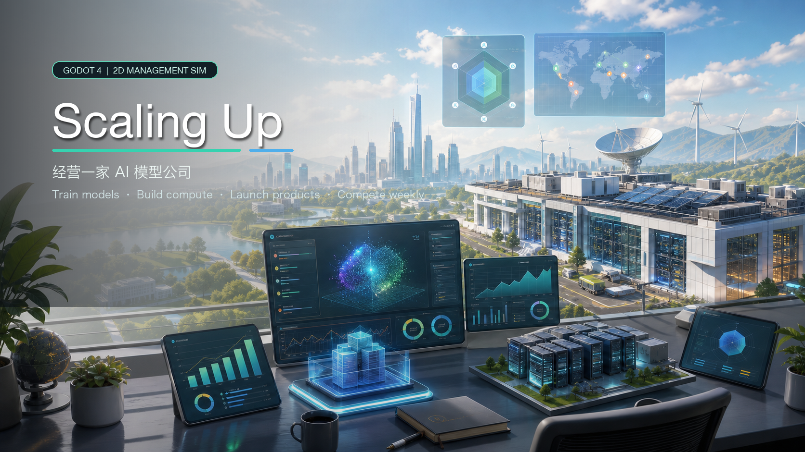
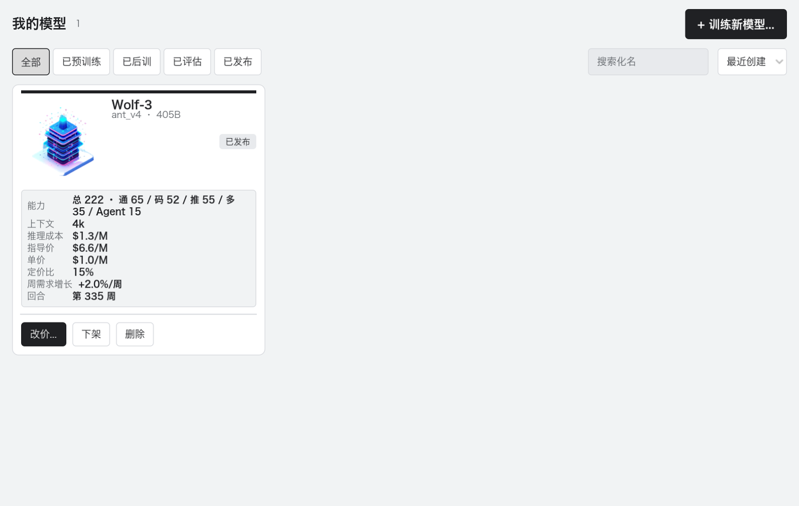
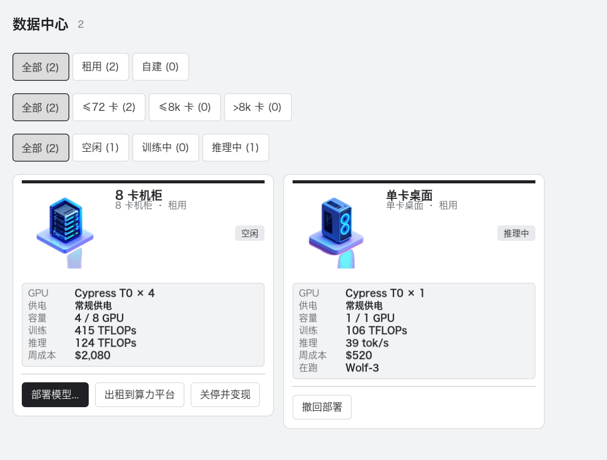
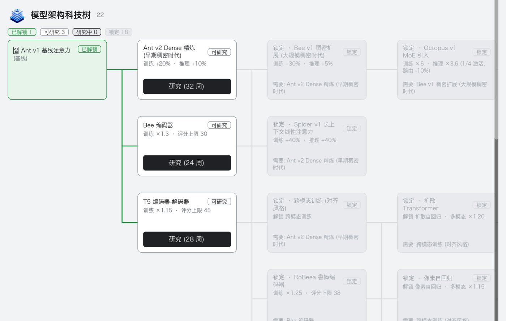

# Scaling Up


**中文** | [English](#english)



**Scaling Up** 是一款以「经营 AI 模型公司」为题材的 2D 模拟经营游戏。玩家从 2017 年的早期实验室起步，以每周一回合推进公司发展：训练模型、建设算力、招募人才、上线产品、追赶榜单、融资求生，并在长期经营中把一家小团队带向更大的技术野心。

项目使用 **Godot 4.4.1 stable** 开发，目前版本为 **0.1.1-alpha**。

## 界面预览 / Screenshots

| 起始页 / Start Screen | 模型管理 / Model Management |
|---|---|
|  |  |

| 基建与算力 / Infrastructure | 科技树 / Tech Tree |
|---|---|
|  |  |

| 办公室 / Office |
|---|
|  |

## 玩法特色

- **每周一回合**：工资、机房成本、任务进度、用户增长、营收与事件按周结算。
- **模型生命周期**：从预训练、后训练、评估到发布，模型能力会影响产品解锁、用户增长和排行榜表现。
- **真实量纲数值**：训练和推理使用 FLOPs、TFLOPs、B tokens、tokens/s 等单位，尽量贴近现实工程尺度。
- **算力基础设施**：租赁或自建数据中心，购买 GPU，选择供电方式，并在训练与推理之间分配资源。
- **人才与组织**：招聘不同专长的 lead 与 staff，用团队能力影响训练、研究、营销和运营。
- **产品与商业化**：发布 API、聊天产品、智能体、多模态助手和代码助手，通过订阅与调用量获得收入。
- **科技树与竞争对手**：沿架构、注意力、损失函数、工程优化、应用能力和上下文长度六条线推进研发。
- **事件、公益和收藏**：机会、危机、融资、慈善项目、办公室荣誉与收藏品共同构成长线经营目标。

游戏中的 GPU、模型、架构和公司命名采用植物 / 动物化名，避免在代码、资源和 UI 中直接出现现实品牌名。

## 当前状态

这是一个开发中的 alpha 版本。当前已经具备核心经营闭环：

- 起始页、新游戏、存读档、设置与新手引导
- 主 HUD 与多 tab 管理界面
- 经济、招聘、基建、数据集、研究、任务、科技树、市场、用户、产品、营收、营销、事件、慈善、收藏、宇宙模拟等系统
- 中文默认、英文翻译管线
- GUT 单元测试与集成测试

平衡性、内容量、正式发行流程和跨平台导出仍在持续迭代。

## 快速开始

### 环境要求

- Godot Engine **4.4.1 stable**
- Git
- GUT 9.x Godot 4 兼容版，用于测试，需本地安装到 `addons/gut/`
- Godot 4.4.1 macOS 导出模板，仅打包时需要

macOS 上的完整安装说明见 [docs/开发环境配置.md](docs/开发环境配置.md)，打包配置见 [docs/构建与发布.md](docs/构建与发布.md)。

### 打开工程

```bash
git clone <repo-url> scaling-up
cd scaling-up
godot --headless --import
godot --path .
```

也可以在 Godot 编辑器中扫描并导入本目录。主场景为 `res://scenes/start_screen/start_screen.tscn`。

### 安装测试插件

干净 clone 后需要本地安装 GUT：

```bash
mkdir -p addons
cd addons
git clone --depth 1 --branch godot_4 https://github.com/bitwes/Gut.git gut
```

安装后在 Godot 编辑器中启用插件：`Project -> Project Settings -> Plugins -> GUT -> Enable`。

## 运行测试

单元测试：

```bash
godot --headless --path . -s addons/gut/gut_cmdln.gd -gdir=res://tests/unit -gexit
```

集成测试：

```bash
godot --headless --path . -s addons/gut/gut_cmdln.gd -gdir=res://tests/integration -gexit
```

只跑某个测试文件：

```bash
godot --headless --path . -s addons/gut/gut_cmdln.gd -gselect=start_screen_test.gd -gexit
```

更多调试方法见 [docs/端到端调试.md](docs/端到端调试.md)。

## 构建

当前首发导出目标是 macOS。发布流程、版本号约定和导出预设说明见 [docs/构建与发布.md](docs/构建与发布.md)。

简化流程：

```bash
# 先在 Godot 编辑器里创建本地 export_presets.cfg
godot --headless --path . -s addons/gut/gut_cmdln.gd -gdir=res://tests/unit -gexit
godot --headless --path . -s addons/gut/gut_cmdln.gd -gdir=res://tests/integration -gexit
mkdir -p build/macos
godot --headless --path . --export-release "macOS" build/macos/Scaling-Up.app
```

## 项目结构

```text
project.godot          Godot 工程入口
README.md              GitHub 项目介绍与快速开始
CLAUDE.md / AGENTS.md  协作约定、目录职责与开发工作流
scenes/                场景与 UI，按功能组织
scripts/               Autoload、业务系统与 Resource 脚本
resources/             .tres 静态数据、i18n 与主题资源
assets/                字体、图片、音频等运行时素材
tests/                 GUT 单元测试与集成测试
design/                中文设计文档
docs/                  开发、调试、构建与发布文档；media/readme 存放 README 展示图
tools/                 一次性脚本、素材管线与诊断工具
```

更完整的工程约定见 [CLAUDE.md](CLAUDE.md)，系统设计入口见 [design/index.md](design/index.md)。

## 开发约定

- 修改功能前先更新对应 `design/` 文档，再写测试，最后实现代码。
- 跨系统通信走 `EventBus`，持久化状态放在 `GameState`，推进回合统一通过 `TurnManager`。
- 代码、Godot 文件和提交信息使用英文；`design/` 与协作文档使用中文。
- 人面文案走 i18n 管线，不在 UI 代码中硬编码中文。
- 资源文件优先使用 `.tres`。

## 许可证

暂未声明开源许可证。公开发布或允许外部复用前，请先补充 `LICENSE`。

---

## English

**Scaling Up** is a 2D management simulation game about running an AI model company. The player starts from a small lab in 2017 and advances one week per turn: train models, build compute infrastructure, hire talent, launch products, compete on leaderboards, raise funding, and grow a small team into a more ambitious technology company.

The project is built with **Godot 4.4.1 stable**. Current version: **0.1.1-alpha**.

## Gameplay Highlights

- **Weekly turns**: payroll, datacenter costs, task progress, user growth, revenue, and events resolve every week.
- **Model lifecycle**: pretrain, posttrain, evaluate, publish, and serve models. Capability affects product unlocks, user growth, and leaderboard performance.
- **Real-world units**: training and inference use FLOPs, TFLOPs, B tokens, tokens/s, and similar units instead of abstract compute points.
- **Compute infrastructure**: rent or build datacenters, buy GPUs, choose power supplies, and split resources between training and serving.
- **Hiring and organization**: recruit leads and staff with different specialties to improve training, research, marketing, and operations.
- **Products and monetization**: launch APIs, chatbots, agents, multimodal assistants, and coding agents, then earn revenue through subscriptions and usage.
- **Tech tree and competitors**: progress through architecture, attention, loss, engineering, application, and context-length research lines.
- **Events, charity, and collections**: opportunities, crises, fundraising, charity projects, office honors, and collectibles provide long-term goals.

GPU, model, architecture, and company names use fictional plant / animal codenames. Real brand names are intentionally avoided in code, resources, and UI copy.

## Current Status

This is an alpha-stage project. The core management loop is already in place:

- Start screen, new game flow, save/load, settings, and tutorial
- Main HUD with multi-tab management views
- Economy, hiring, infrastructure, dataset, research, task, tech tree, market, user, product, monetization, marketing, event, charity, collection, and simulation systems
- Chinese as the default language, with an English translation pipeline
- GUT unit and integration tests

Balancing, content volume, release workflow, and cross-platform exports are still under active development.

## Quick Start

### Requirements

- Godot Engine **4.4.1 stable**
- Git
- GUT 9.x for Godot 4, installed locally at `addons/gut/`
- Godot 4.4.1 macOS export templates, only needed for packaging

For macOS setup details, see [docs/开发环境配置.md](docs/开发环境配置.md). For packaging, see [docs/构建与发布.md](docs/构建与发布.md).

### Open the Project

```bash
git clone <repo-url> scaling-up
cd scaling-up
godot --headless --import
godot --path .
```

You can also import the folder from the Godot editor. The main scene is `res://scenes/start_screen/start_screen.tscn`.

### Install the Test Plugin

After a clean clone, install GUT locally:

```bash
mkdir -p addons
cd addons
git clone --depth 1 --branch godot_4 https://github.com/bitwes/Gut.git gut
```

Then enable it in the editor: `Project -> Project Settings -> Plugins -> GUT -> Enable`.

## Running Tests

Unit tests:

```bash
godot --headless --path . -s addons/gut/gut_cmdln.gd -gdir=res://tests/unit -gexit
```

Integration tests:

```bash
godot --headless --path . -s addons/gut/gut_cmdln.gd -gdir=res://tests/integration -gexit
```

Run one test file:

```bash
godot --headless --path . -s addons/gut/gut_cmdln.gd -gselect=start_screen_test.gd -gexit
```

For more debugging workflows, see [docs/端到端调试.md](docs/端到端调试.md).

## Build

The first export target is macOS. Release steps, versioning, and export preset notes are documented in [docs/构建与发布.md](docs/构建与发布.md).

Short version:

```bash
# Create a local export_presets.cfg in the Godot editor first.
godot --headless --path . -s addons/gut/gut_cmdln.gd -gdir=res://tests/unit -gexit
godot --headless --path . -s addons/gut/gut_cmdln.gd -gdir=res://tests/integration -gexit
mkdir -p build/macos
godot --headless --path . --export-release "macOS" build/macos/Scaling-Up.app
```

## Project Layout

```text
project.godot          Godot project entry
README.md              GitHub overview and quick start
CLAUDE.md / AGENTS.md  Collaboration rules, directory ownership, and workflow
scenes/                Feature-organized scenes and UI
scripts/               Autoloads, gameplay systems, and Resource scripts
resources/             .tres static data, i18n, and theme resources
assets/                Runtime fonts, sprites, and audio
tests/                 GUT unit and integration tests
design/                Chinese design documents
docs/                  Development, debugging, build, release docs, and README media
tools/                 One-off scripts, asset pipeline, and diagnostics
```

See [CLAUDE.md](CLAUDE.md) for the full project conventions and [design/index.md](design/index.md) for the system design index.

## Development Notes

- Update the relevant `design/` document before changing behavior, then write tests, then implement.
- Use `EventBus` for cross-system communication. Persistent state belongs in `GameState`; weekly progression goes through `TurnManager`.
- Code, Godot files, and commit messages are written in English. `design/` and collaboration docs are written in Chinese.
- Player-facing copy should go through the i18n pipeline instead of being hardcoded in UI scripts.
- Prefer `.tres` resources over `.res`.

## License

No open-source license has been declared yet. Add a `LICENSE` file before publishing this repository for external reuse.
